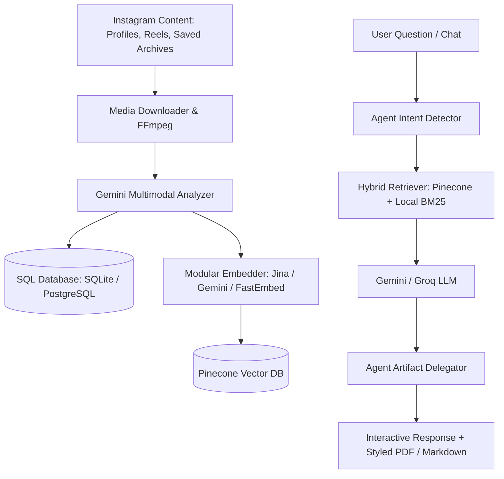

<div align="center">

# InstaRAG

[](https://www.python.org/)
[](https://fastapi.tiangolo.com/)
[](https://www.pinecone.io/)
[](https://www.docker.com/)

</div>

InstaRAG is a modular, production-ready Instagram knowledge extraction and Retrieval-Augmented Generation (RAG) system. It ingests public creator profiles, standalone reels, and saved post archives, extracts multimodal knowledge using Google Gemini, indexes semantic representations into Pinecone, and delivers grounded answers, multi-turn conversational agents, and structured document exports (PDF/Markdown).

---

## Features

- **Multimodal Video & Audio Extraction:** Transcribes speech, extracts on-screen text overlays, and captures structured facts (measurements, ingredients, exercise forms, and technical steps).
- **Hybrid Retrieval (Dense + BM25):** Combines dense vector similarity with BM25 sparse keyword ranking via Reciprocal Rank Fusion (RRF).
- **Modular Multi-Provider Embeddings:** Pluggable embedding providers supporting Jina AI v3, Google Gemini, and 100% local ONNX FastEmbed with automatic fallback failover.
- **Autonomous Agentic Delegation:** Automatically detects user intent to produce structured artifacts (workout routines, recipe books, grocery checklists) and exports them to styled PDF or Markdown.
- **Executive PDF Rendering Engine:** Generates clean, minimalist black-and-white documents with structured tables, direct clickable links to Instagram reels, and concise source summaries.
- **Multi-Tenant Scoped Groups:** Define isolated knowledge domains (e.g. Fitness, Cooking, Biohacking) and grant shared read permissions across accounts.
- **Deduplicated Knowledge Base:** Shared creator posts are ingested and embedded only once globally across all users and groups.
- **Production REST API:** High-performance FastAPI server with asynchronous background job workers and healthcheck endpoints.

---

## Architecture



---

## Installation

### Prerequisites
- Python 3.12+
- FFmpeg installed on system path
- `uv` package manager

### 1. Clone and Install Dependencies
```bash
git clone https://github.com/your-username/instarag.git
cd instarag
uv sync --extra api
```

### 2. Environment Configuration
Create a `.env` file in the project root:
```ini
GEMINI_API_KEY=your_gemini_api_key
PINECONE_API_KEY=your_pinecone_api_key
APIFY_API_KEY=your_apify_api_key

# Optional Configurations
EMBED_PROVIDER=auto
JINA_API_KEY=your_jina_api_key
GROQ_API_KEY=your_groq_api_key
INSTARAG_DATABASE_URL=sqlite:////data/instarag.db
INSTARAG_API_KEY=your_optional_secret_api_key
```

---

## Command Line Interface (CLI)

> [!TIP]
> Once installed globally with `uv tool install --editable .`, you can use `instarag` directly. Alternatively, use `uv run instarag <command>`.

### User Management
```bash
instarag user create <username>
instarag user list
```

### Profile Management & Scraping
```bash
# Register a creator profile (optionally with default interests)
instarag profile add <creator_username> --interests "calisthenics, mobility"

# Scrape posts: indexes all posts, but only downloads full video/media for posts matching interests
instarag profile scrape <creator_username> --max-posts 50 --interests "calisthenics, mobility"

# Incremental update since last scrape
instarag profile update <creator_username>

# List tracked creator profiles
instarag profile list
```

### Scoped RAG Groups (Agents)
```bash
# Create a scoped group / knowledge agent
instarag group create <group_name> --desc "Topic Knowledge Base"

# List groups
instarag group list

# Add posts from a creator profile (optional topic filtering)
instarag group add-from-profile <group_name> <creator_username> --interests "workout, hypertrophy"

# Add a single reel or post URL / ID to a group
instarag group add-post <group_name> https://instagram.com/reel/<shortcode>/

# Share group access with another user
instarag group share <group_name> <target_username>
```

### Saved Posts Ingestion
```bash
# Import saved posts archive (.zip or saved_posts.json)
instarag saved import <path_to_saved_posts.json>

# Process and index imported saved posts
instarag saved process --workers 4
```

### Knowledge Query & Document Export
```bash
# General query with hybrid search
instarag query "Explain the proper technique for shoulder press"

# Query scoped to a group with autonomous PDF export
instarag query "Create a 4-day upper lower workout routine in PDF" -g <group_name> -o routine.pdf

# Query scoped to a specific creator with Markdown export
instarag query "Consolidate the ingredients for weekly meal prep" -c <creator_username> -o grocery_list.md
```

### Interactive Chat Session
```bash
instarag chat -g <group_name>
```

---

## HTTP REST API

Start the API server:
```bash
instarag-api
# or via uv:
# uv run instarag-api
```
Interactive OpenAPI documentation is available at `http://localhost:8000/docs`.

### Core Endpoints
| Method | Endpoint | Description |
|---|---|---|
| `GET` | `/health` | Service health status |
| `POST` | `/query` | Execute hybrid RAG query with optional artifact delegation |
| `POST` | `/run` | Trigger asynchronous profile ingestion job |
| `POST` | `/reels` | Ingest standalone reel URLs |
| `POST` | `/groups` | Create scoped RAG agent group |
| `POST` | `/groups/{group_id}/share` | Share group access with another user |
| `GET` | `/jobs/{job_id}` | Monitor background task progress |

---

## Docker & Cloud Deployment

### Build and Run Locally
```bash
docker build -t instarag:latest .
docker run -d -p 8000:8000 -v instarag_data:/data --env-file .env instarag:latest
```

### Cloud Platforms (Render, Railway, Fly.io, Google Cloud Run)
- The container executes as a non-root user (`instarag`).
- Binds dynamically to the cloud environment `$PORT`.
- Persistent data stored under `/data`.
- Automated healthcheck configured on `/health`.

---

## Testing

Run the test suite:
```bash
uv run pytest
```

---

## License

MIT License.
