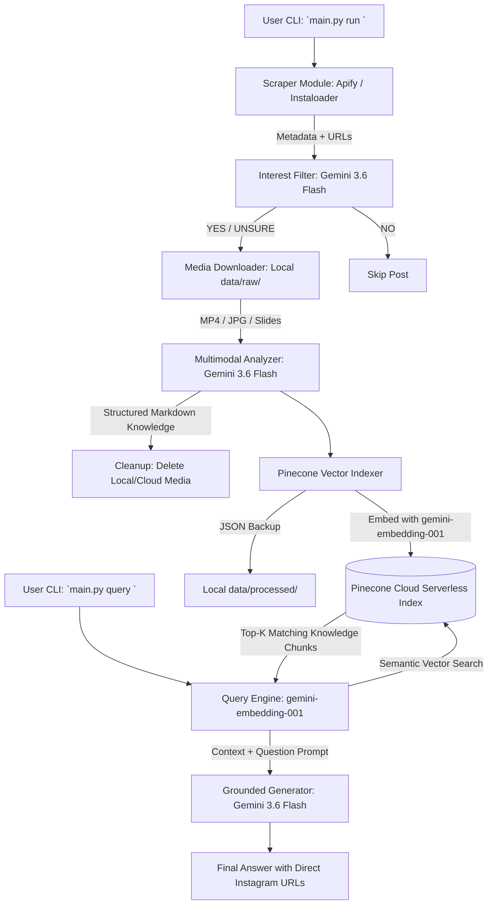

# System Architecture: InstagramProfile2RAG

## Overview
**InstagramProfile2RAG** is a zero-cost, privacy-first, modular data pipeline and Retrieval-Augmented Generation (RAG) system. It transforms content from Instagram profiles (videos, carousels, infographics, and text) into a structured vector database that can be queried with natural language, always citing original publication links.

## Key Principles & Design Decisions

1. **Zero-Cost Free-Tier Operations**:
   - Scraping: Apify Actor free monthly allowance.
   - Multimodal Analysis & Embeddings: Gemini API free tier with rate-limit retries.
   - Vector Storage: Pinecone Serverless free tier.
2. **Ephemeral Local Storage**:
   - Heavy video and image files are downloaded temporarily to `data/raw/`, uploaded to Gemini for knowledge extraction, and deleted immediately to preserve disk space.
3. **Multi-Profile Configuration & Deduplication**:
   - Each creator has distinct interests and a tracked list of processed post shortcodes in `~/.ig_profile_to_rag/profiles/<username>.json`.
   - Repeated pipeline runs skip previously analyzed posts to conserve API quotas.
4. **Strict RAG Grounding**:
   - The query engine answers strictly based on retrieved creator posts and attaches verified links.
