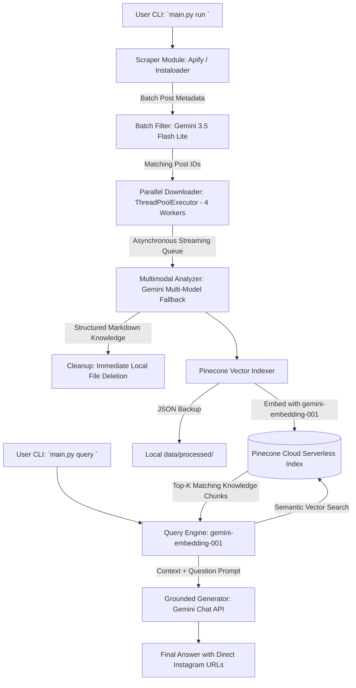

# System Architecture: InstagramProfile2RAG

## Overview
**InstagramProfile2RAG** is a zero-cost, privacy-first, modular data pipeline and Retrieval-Augmented Generation (RAG) system. It transforms content from Instagram profiles (videos, carousels, infographics, and text) into a structured vector database that can be queried with natural language, always citing original publication links.

## Performance & Resilience Features

1. **High-Speed Batch Filtering**:
   - Groups up to 40 posts per single Gemini API call to reduce latency from minutes to seconds.
2. **Parallel Downloads & Streaming Execution**:
   - Media items (videos, carousel slides, images) download concurrently with 4 worker threads.
   - As soon as the first download finishes, it streams directly into the Gemini Analyzer, keeping the GPU/API pipeline continuously fed.
3. **Multi-Model Fallback Chain**:
   - Handles `503 UNAVAILABLE` (model high demand) and `429` (rate limits) by automatically cascading across models: `gemini-3.5-flash-lite` -> `gemini-3.7-flash` -> `gemini-3.6-flash`.
4. **Zero-Cost Free-Tier Operations**:
   - Apify free monthly allowance for scraping.
   - Gemini API free tier for analysis & embeddings.
   - Pinecone Serverless free tier for vector storage.
5. **Strict Provenance Guarantee**:
   - Answers are synthesized strictly from retrieved creator posts with verified Instagram links.
