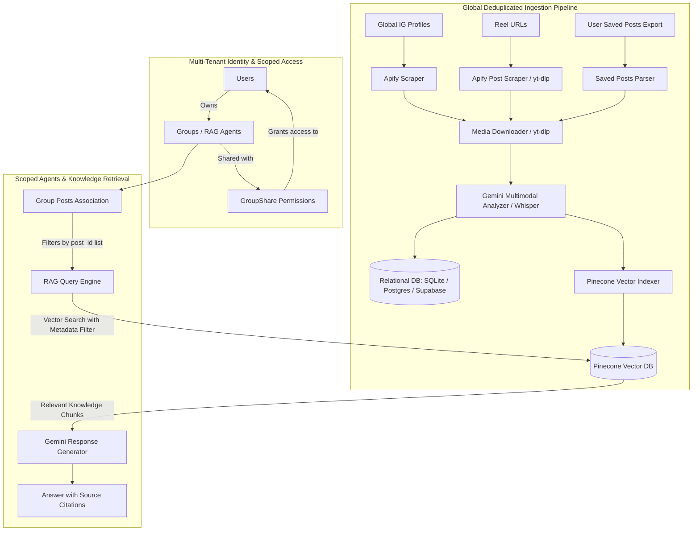

# System Architecture: InstaRAG

## Overview

InstaRAG is a modular, multi-tenant knowledge ingestion pipeline and Retrieval-Augmented Generation (RAG) system. The application transforms public Instagram content (videos, carousels, infographics, captions, and user saved post exports) into structured, queryable knowledge. Extracted insights are indexed into a Pinecone vector database, while relational relationships (users, groups, and permissions) are maintained in an SQL database via SQLAlchemy.

---

## Architectural Principles and Design Decisions

### 1. Global Ingestion vs. User-Scoped RAG Agents

In standard multi-user architectures, duplicate extraction across users causes significant API cost overhead and database bloat. InstaRAG separates content ingestion from user organization:

- **Global Ingestion (`IGProfile` and `Post`):** When an Instagram profile is scraped or a reel is ingested, the media is analyzed and embedded once globally. Every processed post receives a persistent record in the `posts` table and a corresponding vector in Pinecone.
- **User-Scoped Agents (`Group` and `GroupPost`):** Users create isolated knowledge groups (such as "Low Carb Nutrition" or "Strength Training"). Users associate posts with their groups either manually or by applying LLM-driven interest filtering to an indexed creator's catalog.
- **Zero Duplicate Extractions:** When multiple users track the same creator, save identical reels, or add overlapping content to distinct groups, the pipeline reuses existing extracted knowledge without re-downloading media or regenerating vector embeddings.

### 2. Multi-Tenant Permissions and Collaboration

- Each `Group` is owned by a `User`.
- Owners can grant read access to other accounts via `GroupShare` records.
- Access checks ensure that only group owners or authorized collaborators can execute queries, view member posts, or participate in chats against a specific agent.

### 3. Identity and Database Agnosticism

- **Database Independence:** Built using SQLAlchemy 2.0. By updating `INSTARAG_DATABASE_URL`, the application operates with local SQLite, PostgreSQL, Supabase, or Neon without schema modification.
- **Identity Decoupling:** Users are represented by plain string identifiers (`user_id`). The core ingestion and query engines do not depend on any specific authentication provider, allowing integration with Clerk, Supabase Auth, Firebase, or custom JWT middlewares.

### 4. Pinecone Vector Strategy

- Vectors are indexed with rich metadata: `post_id`, `creator_username`, `url`, `type`, `original_description`, and `extracted_knowledge`.
- When querying a specific Group, Pinecone executes a metadata filter: `{"post_id": {"$in": [list_of_group_post_ids]}}`.
- When querying across a creator: `{"creator_username": {"$eq": "target_creator"}}`.

---

## Module Directory Structure

| Directory | Layer | Description |
|---|---|---|
| `storage/` | Database Layer | SQLAlchemy models (`User`, `IGProfile`, `Post`, `Group`, `GroupPost`, `GroupShare`, `UserSavedPost`) and repository functions. |
| `config/` | Configuration Layer | Entity helper modules (`users.py`, `groups.py`, `ig_profiles.py`, `settings.py`). |
| `src/scraper/` | Ingestion Layer | Apify Actor integrations for creator profiles and post URLs. |
| `src/downloader/` | Media Layer | Concurrent CDN media downloader with yt-dlp fallback. |
| `src/analyzer/` | Analysis Layer | Google Gemini multimodal vision/audio understanding and Whisper transcription fallback. |
| `src/indexer/` | Vector Layer | Pinecone vector embedding and index management. |
| `src/rag/` | Retrieval Layer | Query engine with question condensation, score thresholding, and source citation logic. |
| `src/pipeline/` | Orchestration Layer | Pipeline functions coordinating ingestion, group population, saved posts, and query execution. |
| `src/api/` | Transport Layer | FastAPI REST application with background job workers and OpenAPI documentation. |
